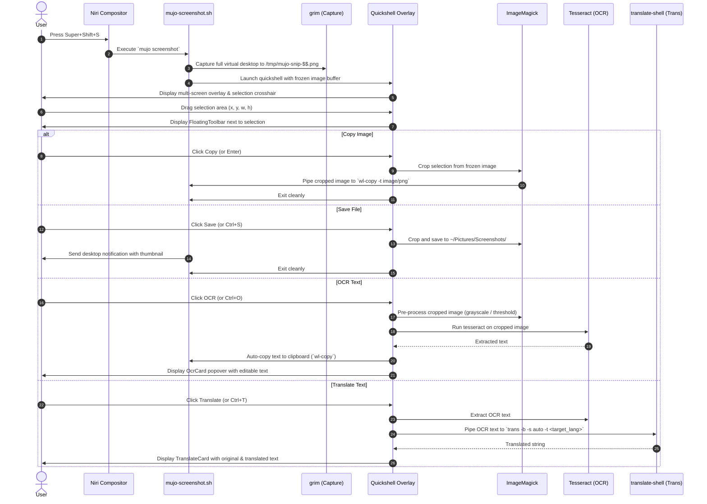

# Specification: Mujō Quickshell Screenshot, OCR & Translation Tool

**Date:** 2026-08-28  
**Topic:** Quickshell native screenshot tool with OCR and Translation  
**Status:** Approved  

---

## 1. Overview & Goals

This project provides a native, feature-rich screenshot tool built directly into Mujō's Quickshell desktop environment. It replaces the external `quicksnip` dependency with a tailored, performant, and thematically consistent solution invoked via `Super+Shift+S`.

### Key Features
1. **Interactive Region Selection**: Darkened multi-monitor overlay, draggable/resizable selection bounding box, pixel magnifier loupe, and dimension badges.
2. **Floating Action Bar**: Positioned alongside the selection with fast 1-click actions:
   - **Copy**: Crop to clipboard (`image/png` via `wl-copy`).
   - **Save**: Save to `~/Pictures/Screenshots/Screenshot_YYYY-MM-DD_HH-MM-SS.png` with notification toast.
   - **OCR**: Optical character recognition using `tesseract` (`eng+ukr` by default), copy text to clipboard, and display text editor modal.
   - **Translate**: OCR + translation using `translate-shell` (`trans`), multi-language target selector, and side-by-side view.
   - **Annotate**: Drawing tools (pen, arrow, rectangle, highlighter, blur/redact, text, color picker).
   - **Pin**: Pin cropped region as a borderless floating tool window on desktop.
3. **Deep Desktop & Theme Integration**: Uses `Theme.qml`, `Icons.qml`, and `Anim.qml` for real-time styling that adapts to the active desktop theme preset.

---

## 2. Architecture & File Structure

```
quickshell/
├── screenshot/
│   ├── screenshot.qml          # Entry point: multi-monitor Overlay layer
│   ├── SelectionArea.qml       # Draggable & resizable selection box with 8 handles
│   ├── FloatingToolbar.qml     # Action bar (Copy, Save, OCR, Translate, Annotate, Pin, Close)
│   ├── OcrCard.qml             # Floating popover showing editable recognized text
│   ├── TranslateCard.qml       # Floating popover showing source + translated text with language selector
│   ├── AnnotationCanvas.qml    # Overlay canvas for drawing shapes, text, and blur
│   ├── Loupe.qml               # Cursor magnifier & coordinates display
│   └── qmldir                  # Module export definitions
├── mujo-screenshot.sh          # Helper wrapper: CLI flags, grim freeze capture, OCR, and translation
└── _default.nix                # Derivations for mujo-screenshot package
```

---

## 3. Detailed Workflow & Data Flow



---

## 4. Component Specifications

### 4.1 `screenshot.qml` & `SelectionArea.qml`
- Layer: `WlrLayer.Overlay` on `Quickshell.screens`.
- Keyboard Focus: `WlrKeyboardFocus.Exclusive`.
- Key Bindings:
  - `Escape`: Cancel and exit.
  - `Enter` / `Ctrl+C`: Copy cropped image to clipboard.
  - `Ctrl+S`: Save cropped image to disk.
  - `Ctrl+O`: Trigger OCR.
  - `Ctrl+T`: Trigger Translation.
  - `Ctrl+Z`: Undo annotation stroke.

### 4.2 `FloatingToolbar.qml`
- Pill container using `Theme.surface`, `Theme.borderStrong`, and `Theme.cornerRadius`.
- Action buttons using `MaterialIcon`:
  - `content_copy`: Copy image to clipboard.
  - `save`: Save to screenshot directory.
  - `text_fields` / `document_scanner`: OCR text.
  - `translate`: Translate text.
  - `draw` / `edit`: Open drawing annotation palette.
  - `push_pin`: Pin screenshot.
  - `close`: Cancel.

### 4.3 `OcrCard.qml`
- Displays recognized text in a scrolling text field (`Theme.text`, monospace font option).
- Buttons:
  - `[Copy Text]`: Copies extracted text to clipboard.
  - `[Translate]`: Switches directly to `TranslateCard` with this text.
  - `[Close]`: Closes popover and returns to selection.

### 4.4 `TranslateCard.qml`
- Shows:
  - Source text preview.
  - Target language selector (English, Ukrainian, German, Spanish, French, Japanese, Chinese, etc.).
  - Translated output text field.
- Buttons:
  - `[Copy Translation]`: Copies translated string to clipboard.
  - `[Ask AI]`: Invokes `mujo ai chat` if advanced explanation is requested.
  - `[Close]`: Closes popover.

---

## 5. Configuration & Persistence

Configuration stored in `~/.config/qsshell/screenshot.json`:
```json
{
  "saveDirectory": "~/Pictures/Screenshots",
  "targetLanguage": "en",
  "ocrLanguages": "eng+ukr",
  "autoCopyOnSave": true,
  "showLoupe": true
}
```

---

## 6. NixOS & Flake Integration

1. **`quickshell/_default.nix`**:
   Add `mujo-screenshot` package wrapping `quickshell`, `grim`, `imagemagick`, `tesseract`, `translate-shell`, `wl-clipboard`, and `libnotify`.
2. **`modules/flake/perSystem.nix`**:
   Export `packages.mujo-screenshot`.
3. **`modules/wrappers/niri.nix`**:
   Bind `"Mod+Shift+S".spawn-sh = "mujo screenshot";` (or `mujo-screenshot`).
4. **`quickshell/mujo.sh`**:
   Add `mujo screenshot [region|full|ocr|translate]` command.

---

## 7. Verification Plan

1. **Automated Evaluation**:
   - `nix flake check`
2. **Manual & Interactive Verification**:
   - Run `qs -p quickshell/screenshot/screenshot.qml` on test images.
   - Trigger `Super+Shift+S` to verify:
     - Freezing and region selection.
     - Copying image to clipboard.
     - Saving to `~/Pictures/Screenshots/`.
     - OCR text extraction and clipboard copy.
     - Translation to target languages (e.g. English, Ukrainian).
     - Annotations and shape drawing.
     - Cancellation with `Escape`.
